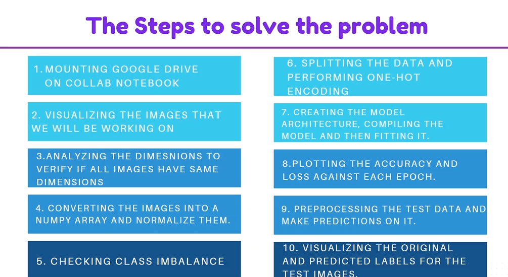
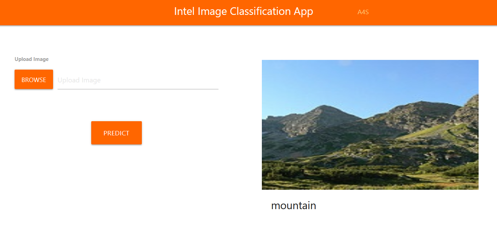

In this project, we will be working on Intel images i.e. images of buildings, forest, street, etc. We will built a convolutional neural network and train it on this images. This is a multi class classification problem and we will use Keras.

# Installation

- 1 - create a virtual environment and activate
- 2 - pip install virtualenv
- - virtualenv envname
- - envname\scripts\activate
- 3 - cd into project
- 4 - pip install -r requirements.txt
- 5 - run in cmd: py app.py

# Steps

# HomePage

